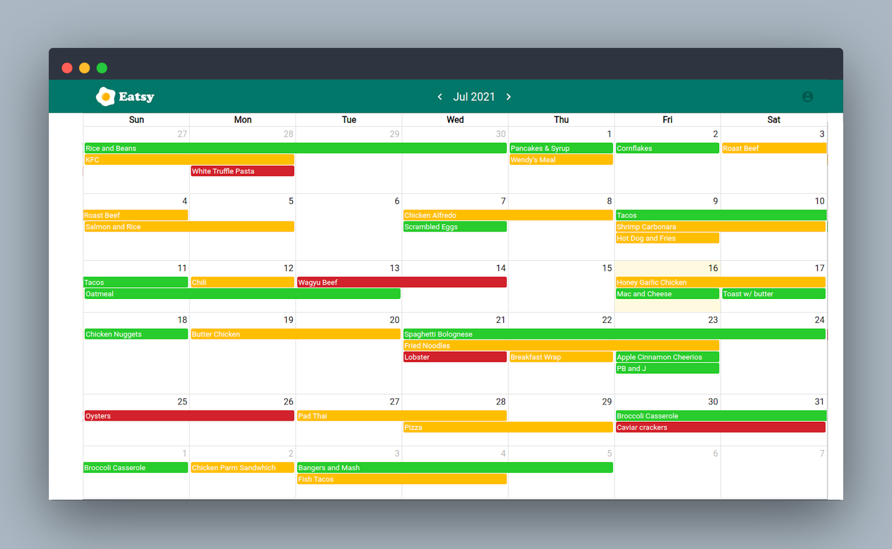

<!--
*** Thanks for checking out the Best-README-Template. If you have a suggestion
*** that would make this better, please fork the repo and create a pull request
*** or simply open an issue with the tag "enhancement".
*** Thanks again! Now go create something AMAZING! :D
***
***
***
*** To avoid retyping too much info. Do a search and replace for the following:
*** martinivnv, meal-prep-app, email, project_title, project_description
-->


<!-- PROJECT SHIELDS -->
<!--
*** I'm using markdown "reference style" links for readability.
*** Reference links are enclosed in brackets [ ] instead of parentheses ( ).
*** See the bottom of this document for the declaration of the reference variables
*** for contributors-url, forks-url, etc. This is an optional, concise syntax you may use.
*** https://www.markdownguide.org/basic-syntax/#reference-style-links
-->

:warning: **Eatsy is currently down!**: I am currently dealing with fixing server issues caused by Heroku shutting down their free tier servers.

<!-- PROJECT LOGO -->
<br />
<p align="center">
  <a href="https://github.com/martinivnv/meal-prep-app">
    
  </a>

  <h3 align="center">Eatsy - Meal Prep Tracking App</h3>

  <p align="center">
    A full-stack app for planning and tracking your meals to save money and reduce food waste.
    <br />
    <a href="https://github.com/martinivnv/meal-prep-app"><strong>Explore the docs »</strong></a>
    <br />
    <br />
    <a href="https://eatsy-meal-prep.netlify.app/">View Demo</a>
    ·
    <a href="https://github.com/martinivnv/meal-prep-app/issues">Report Bug</a>
    ·
    <a href="https://github.com/martinivnv/meal-prep-app/issues">Request Feature</a>
  </p>
</p>


<!-- TABLE OF CONTENTS -->
<details open="open">
  <summary><h2 style="display: inline-block">Table of Contents</h2></summary>
  <ol>
    <li>
      <a href="#screenshots">Screenshots</a>
    </li>
    <li>
      <a href="#about-the-project">About The Project</a>
      <ul>
        <li><a href="#built-with">Built With</a></li>
      </ul>
    </li>
    <li>
      <a href="#getting-started">Getting Started</a>
      <ul>
        <li><a href="#prerequisites">Prerequisites</a></li>
        <li><a href="#installation">Installation</a></li>
      </ul>
    </li>
    <li><a href="#usage">Usage</a></li>
    <li><a href="#roadmap">Roadmap</a></li>
    <li><a href="#contributing">Contributing</a></li>
    <li><a href="#contact">Contact</a></li>
  </ol>
</details>

## Images
<p align="center">

    <p align="center">
      Figure 1: Application in use
    </p>
</p>

<!-- ABOUT THE PROJECT -->
## About The Project

A full-stack app for planning and tracking your meals to save money and reduce food waste. Reads meals from a MongoDB database using a custom-built API and displays them in a calendar, allowing the user to add, update, and delete meals. The functionality of the app mimics that of Google Calendar.

### Built With

* MongoDB
* Express.js
* React.js
* Node.js
* fullCalendar.js
* Material UI

<!-- GETTING STARTED -->
## Getting Started

To get a local copy up and running follow these simple steps.

### Prerequisites

* npm
  ```sh
  npm install npm@latest -g
  ```

### Installation

1. Clone the repo
   ```sh
   git clone https://github.com/martinivnv/meal-prep-app.git
   ```
2. Install NPM packages for clientside
   ```sh
   cd client
   npm install
   ```
3. Run clientside
   ```sh
   cd client
   npm start
   ```
4. Install NPM packages for serverside
   ```sh
   cd server
   npm install
   ```
5. Run serverside
   ```sh
   cd server
   npm run dev
   ```

<!-- USAGE EXAMPLES -->
## Usage

Try it out: [https://eatsy-meal-prep.netlify.app/](https://eatsy-meal-prep.netlify.app/)

<!-- ROADMAP -->
## Roadmap

See the [open issues](https://github.com/martinivnv/meal-prep-app/issues) for a list of proposed features (and known issues).


<!-- CONTRIBUTING -->
## Contributing

Contributions are what make the open source community such an amazing place to be learn, inspire, and create. Any contributions you make are **greatly appreciated**.

1. Fork the Project
2. Create your Feature Branch (`git checkout -b feature/AmazingFeature`)
3. Commit your Changes (`git commit -m 'Add some AmazingFeature'`)
4. Push to the Branch (`git push origin feature/AmazingFeature`)
5. Open a Pull Request


<!-- LICENSE -->
## License

Distributed under the MIT License. See `LICENSE` for more information.


<!-- CONTACT -->
## Contact

Martin Ivanov - martinivnv2002@gmail.com

Project Link: [https://github.com/martinivnv/meal-prep-app](https://github.com/martinivnv/meal-prep-app)

Live Link: [https://eatsy-meal-prep.netlify.app/](https://eatsy-meal-prep.netlify.app/)
